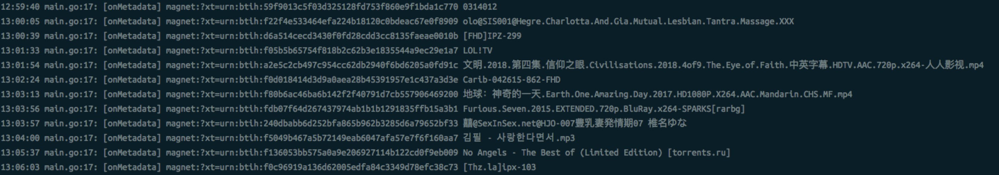

# magnetlink spider
a magnet-link spider in p2p.
一个磁力链接收集器，让你简单快速地收集DHT网络中其他节点下载资源的信息.


#### Install && Usage
    go get -u github.com/bttown/torrent-spider
	go build github.com/bttown/torrent-spider
	./spider

#### Notice
1. 需要运行在公网服务器上, 否则收集到种子的可能性很小(正好形成UDP打洞)
2. 收集器刚启动的时候需要较长的时间(作者使用阿里云1核1G的机器测试大概需要1到2天:()来和DHT网络中的其他节点通信，当我们的节点被大量其他节点收录时，大量资源就会不请自来了 http://bttown.net/



#### Code

```go
package main

import (
	"fmt"
	"github.com/bttown/dht"
	"github.com/bttown/metadata"
	"log"
)

var (
	collectorQueriesBufferSize = 5000
	collectorMaxPendingQueries = 2000
)

var (
	// DHT 节点
	node = dht.NewNode(dht.OptionAddress("0.0.0.0:8662"))
	// 种子信息获取器
	collector = metadata.NewCollector(metadata.Options{
		QueriesBufferSize: collectorQueriesBufferSize,
		MaxPendingQueries: collectorMaxPendingQueries,
	})
)

func main() {
	// 新获取种子时调用的Hook
	collector.OnFinish(func(req metadata.Request, torrent metadata.Torrent) {
		magnetLink := fmt.Sprintf("magnet:?xt=urn:btih:%s", req.HashInfo)
		log.Println("[Metadata]", magnetLink, torrent.Info.Name)
	})
	defer collector.Close()

	// 当发现DHT网络中有人下载资源时，告知收集器去获取种子详细信息
	node.PeerHandler = func(ip string, port int, hashInfo, peerID string) {
		if err := collector.Get(&metadata.Request{
			IP:       ip,
			Port:     port,
			HashInfo: hashInfo,
			PeerID:   peerID,
		}); err != nil {
			panic(err)
		}

	}
	node.Serve()
}

```